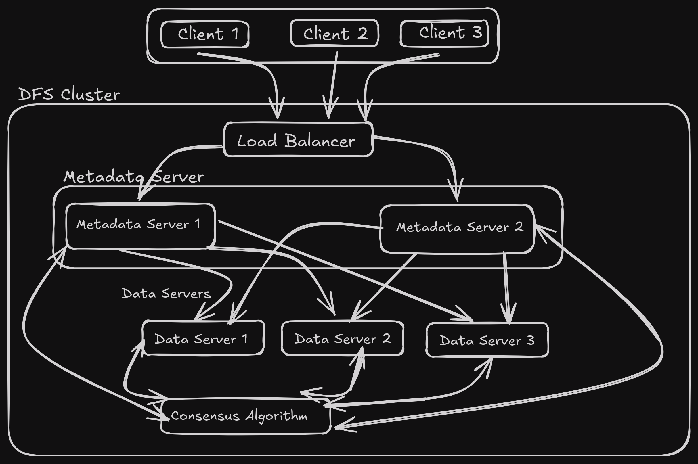

## Architecture

Todos:
- [x] Plan the architecture(client - server)
- [x] Implement a network communication(gRPC)
- [ ] Core operations
   - [ ] File system operations(read, write, delete)
   - [ ] Metadata management
   - [ ] Data storage and retrieval
- [ ] Implement consensus algorithm

Libraries:
- rocksdb - for local storage
- clap - CLI of the app
